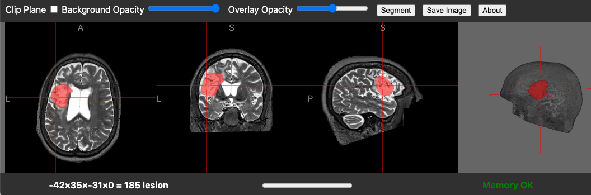

# T2lesion

T2lesion is a web page that uses AI to identify chronic stroke lesions observed on T2-weighted MRI scans. Users can drag-and-drop T2-scans in NIfTI format, for example from the [Aphasia Recovery Cohort](https://openneuro.org/datasets/ds004884).



## Usage

1. Open the [live demo](https://neurolabusc.github.io/T2lesion).
2. **Option 1** The web page automatically loads with a default T2 MRI scan. If you want to use this scan, go to step 5.
3. **Option 2** If your T2 MRI scan is in NIfTI format, drag and drop the file onto the web page.
4. **Option 3** If your image is in DICOM format, it may load if you drag and drop the files. If this fails, convert your images with dcm2niix.
5. Press the `Segment` button to identify the lesion.
6. If you are happy with the result, press the `Save Image` button to save the lesion map.

### Developers - Running a Local Live Demo

This hot-reloadable live demo will refresh the web page each time you modify the code.

```bash
git clone git@github.com:neurolabusc/T2lesion.git
cd T2lesion
npm install
npm run dev
```


### Developers - Building the Web Page

```bash
npm run build
```

## References

### Our group's open source software used in this applicaiton

- [brainchop](https://github.com/neuroneural/brainchop)
- [niivue](https://github.com/niivue/niivue)
- [niimath](https://github.com/rordenlab/niimath)


